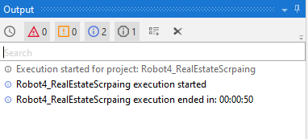
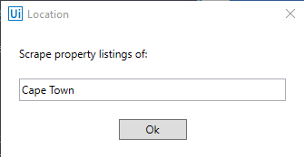
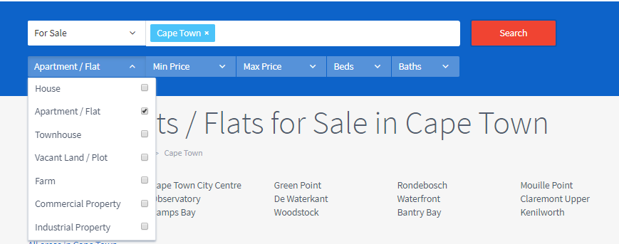
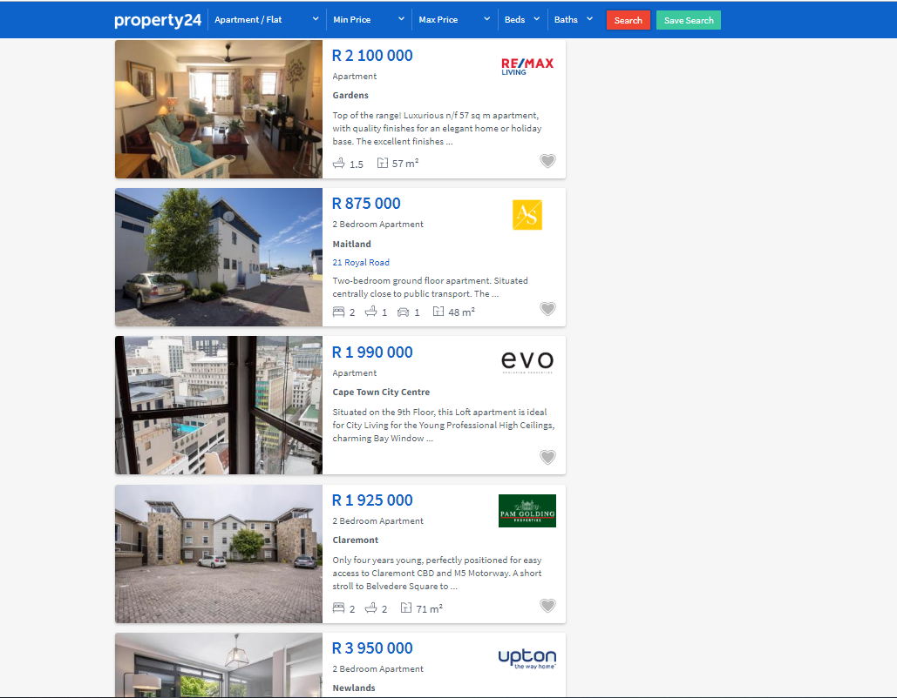
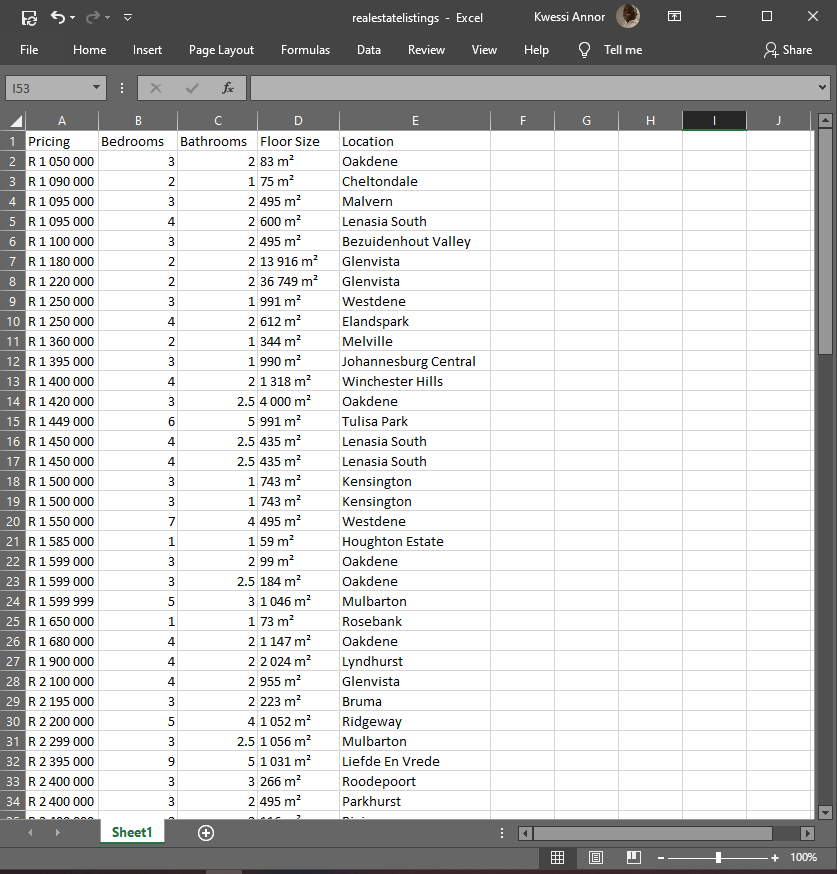
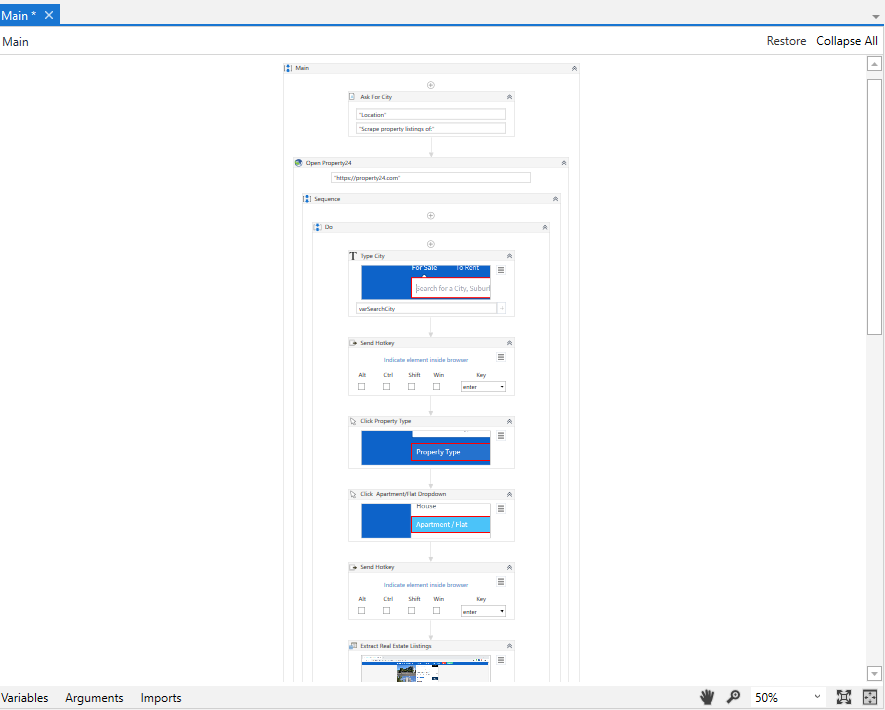

# **Real Estate Scraping** (_Apartment Listings in South Africa_)

A **robotic process automation (RPA)** workflow that scrapes **apartment** listing details from www.property24.com when a user provides a city name in an input dialog box.

## Execution Time

The real power of **Robotic Process Automation** is the productivity gain and amount of time that can be saved from doing boring, repetitive work.

**50 seconds** to complete task.

## Step 1: Enter Location Name

Robot asks for a location name.

## Step 2: Fill Search Form

Robot opens a Google Chrome browser and enters location name in a search box and hits the `enter` key. Also selects Apartment/Flat from the **Property Type** drop down,

## Step 3: Scrape Structured Data

The software robot scrapes price, number of bedrooms, number of bathrooms, floor size and location data of the top 120 apartment listings from a given city in South Africa. (e.g. Cape Town). Steps through multiple pages to scrape the first 120 listings. We can scrape all data if we want.

## Step 4: Export Data to Microsoft Excel

Sort, filter, and export data to Microsoft Excel for further **analysis**

## RPA Workflow

1. Enter a city name in a dialog box
2. Robot enters the name in a search box, hits the `enter` key and selects apartment/flat from the Property type drop down
3. Scrape price, number of bedrooms, number of bathrooms, floor size and location data of the first 100 listings.
4. Sort datadata table by price
5. Filter datatable to remove rows with null values
6. Export datatable to Excel spreadsheet

_Scrape top 120 listings in **50 secs**_

TODO:

- Replicate same for real estate listings in US (Zillow, Trulia) and UK.
- Scrape all data and save to Microsoft Excel
- Analyze data in Excel
- Push data from Excel to a database.
- Create PWA with scraped data (Proof of concept).
